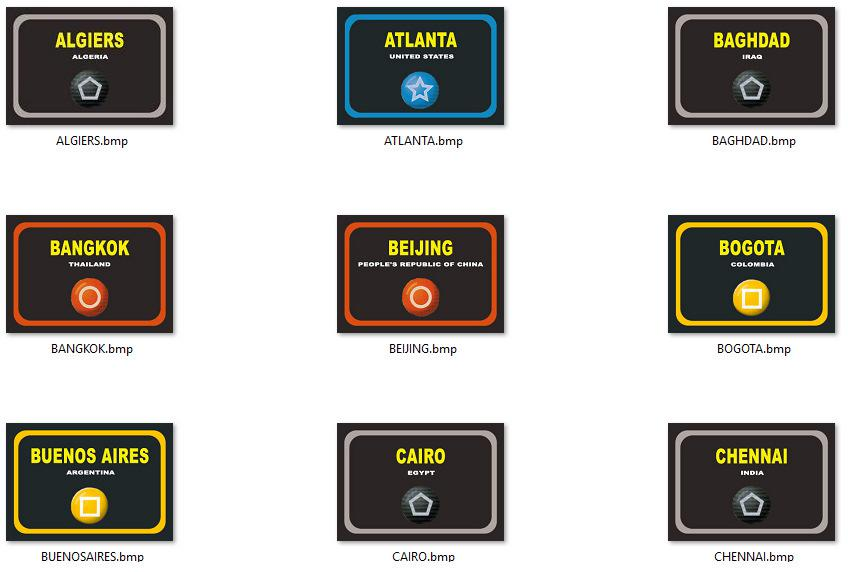
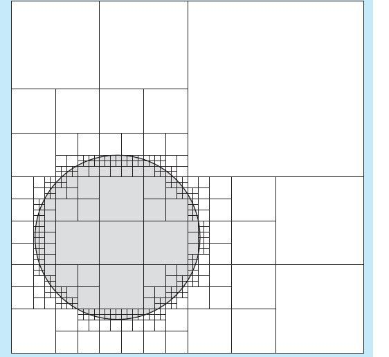

**ALGORITMOS Y ESTRUCTURAS DE DATOS**

**Guía 8. Listas y Arboles**

**Para hacer en clase:**

1.  Implementar una clase template que permita trabajar con una lista
    enlazada genérica (almacena cualquier elemento), tal como fue
    presentado en la clase práctica.

2.  Añadir a la clase anterior funciones miembro para implementar una
    cola genérica.

3.  Añadir a la clase anterior una pila genérica.

**Para entregar:**

Deberán programar un compresor y descompresor de imágenes con el método Quad Tree.

***El compresor de imágenes:***

1.  Recibe un “path” de un directorio y un threshold

2.  Busca en dicho directorio todas las imágenes compatibles en formato PNG.

3.  Genera una ventana de Allegro de 1000 x 600 px.

4.  En dicha ventana mostrará las primeras 9 imágenes en un mosaico de 3x3 como muestra la figura 1.

5.  Le permitirá al usuario elegir las imágenes a comprimir.

    1.  Inicialmente todas las imágenes se encuentran deseleccionadas.

    2.  Mediante el teclado utilizando los números del “1” a “9”, el
        > usuario elige una a una las imágenes que se comrpimirán luego.

    3.  Presionando la “A” elige todas las imágenes (All).

    4.  Presionando la “N” deselecciona todas las imágenes
        > elegidas (None).

    5.  Los números del “1” al “9” funcionan en modo toggle.

6.  Se deberá indicarle al usuario de alguna forma las imágenes
    seleccionadas en cada mosaico (por ejemplo añadiéndole un marco
    verde a las imágenes seleccionadas y uno negro a las que no se
    hayan seleccionado).

7.  Con las flechas “&lt;-” y “-&gt;” el usuario podrá navegar por todas
    las imágenes que se encuentran en el directorio (cada vez que se
    aprieta una u otra se actualiza el mosaico de nueve imágenes con
    las nueve siguientes o las nueve anteriores según corresponda).

8.  Para cada mosaico podrá elegir las imágenes a mostrar repitiendo los ítems 5 y 6.

9.  Cuando haya terminado la selección mediante la tecla ENTER comenzará
    la compresión de cada una de las imágenes seleccionadas. El
    programa generará un archivo con una extensión elegida por el
    grupo por cada imagen que contenga la imagen comprimida con el
    método Quad Tree. El nombre del archivo será el mismo que el de la
    imagen original con la extensión modificada por la elegida por
    el grupo.

10. Una vez que se comprimieron todas las imágenes el programa termina y le indica al usuario lo sucedido esperando su OK para cerrarse.

11. El path y el threshold se reciben por línea de comandos.

***El descompresor de imágenes:***

1.  Recibe un “path” de un directorio.

2.  Busca en dicho directorio todas las imágenes compatibles en formato
    > de compresión que cada grupo haya establecido.

3.  Genera una ventana de Allegro de 1000 x 600 px.

4.  En dicha ventana mostrará los primeros 9 archivos (con un nombre
    > alegórico sobre un rectángulo que el grupo defina) en un mosaico
    > de 3x3 como muestra la figura 1.

5.  Le permitirá al usuario elegir los archivos a descomprimir.

    1.  Inicialmente todos los archivos se encuentran deseleccionados.

    2.  Mediante el teclado utilizando los números del “1” a “9”, el
        > usuario elige uno a uno los archivos que se
        > descomprimirán luego.

    3.  Presionando la “A” elige todos los archivos (All).

    4.  Presionando la “N” deselecciona todos los archivos
        > elegidas (None).

    5.  Los números del “1” al “9” funcionan en modo toggle.

6.  Se deberá indicarle al usuario de alguna forma los archivos
    > seleccionados en cada mosaico (por ejemplo añadiéndole un marco
    > verde a los archivos seleccionados y uno negro a los que no se
    > hayan seleccionado).

7.  Con las flechas “&lt;-” y “-&gt;” el usuario podrá navegar por todos
    > los archivos que se encuentran en el directorio (cada vez que se
    > aprieta uno u otro se actualiza el mosaico de nueve archivos con
    > los nueve siguientes o los nueve anteriores según corresponda).

8.  Para cada mosaico podrá elegir los archivos a descomprimir
    > repitiendo los ítems 5 y 6.

9.  Cuando haya terminado la selección mediante la tecla ENTER comenzará
    > la descompresión de cada uno de los archivos seleccionadas.

10. Una vez que se hayan descomprimido todos los archivos seleccionados
    > el programa termina y le indica al usuario lo sucedido esperando
    > su OK para cerrarse.

11. El path se recibe por línea de comandos.

Figura 1

> Detalles del algoritmo de compresión Quad Tree:

La compresión funciona dividiendo la imagen en cuatro cuartos. Si para
un cuarto las diferencias de color dentro de esa sub-imagen son
pequeñas, se la representa como un nodo terminal de un único color. Si
las diferencias de color son grandes, se representa como otra imagen que
debe ser dividida a su vez en cuatro cuartos. El proceso termina cuando
el tamaño de la sub-imagen llega a un pixel.

Para leer imágenes usaremos la librería lodepng
(*http://lodev.org/lodepng/*), que permite leer y escribir archivos
gráficos PNG de manera sencilla. Las llamadas que nos interesan son:

unsigned LodePNG\_decode32\_file(unsigned char\*\* out, unsigned\* w,
unsigned\* h, const char\* filename);

unsigned LodePNG\_encode32(unsigned char\*\* out, size\_t\* outsize,
const unsigned char\* image, unsigned w, unsigned h);

Trabajaremos en el modo de 32 bits, en el cual cada pixel ocupa 4 bytes.
El primer byte representa la cantidad de color rojo, el segundo verde,
el tercero azul, y el cuarto es el nivel de transparencia (alpha). En
este trabajo ignoraremos el nivel de transparencia al leer, y al
escribir usaremos el valor máximo 0xff.

Para decidir si una sub-imagen tiene casi el mismo color usaremos el
siguiente criterio:

-   Obtener de la sub-imagen el valor mínimo y máximo de rojo
    > (minR, maxR).

-   Obtener de la sub-imagen el valor mínimo y máximo de verde
    > (minG, maxG).

-   Obtener de la sub-imagen el valor mínimo y máximo de azul
    > (minB, maxB).

-   Definir un puntaje en base a la siguiente operación:

> *PUNTAJE* = maxR – minR + maxG – minG + maxB – minB

Para decidir entonces si esas diferencias dentro de una imagen están
acotadas, compararemos el puntaje obtenido con un umbral que deberá ser
pasado en el compresor por línea de comando.

En el caso que el puntaje sea menor que el umbral, se deberá reemplazar
cada componente de color por el promedio de las componentes
pertenecientes al cuadrante bajo análisis.
